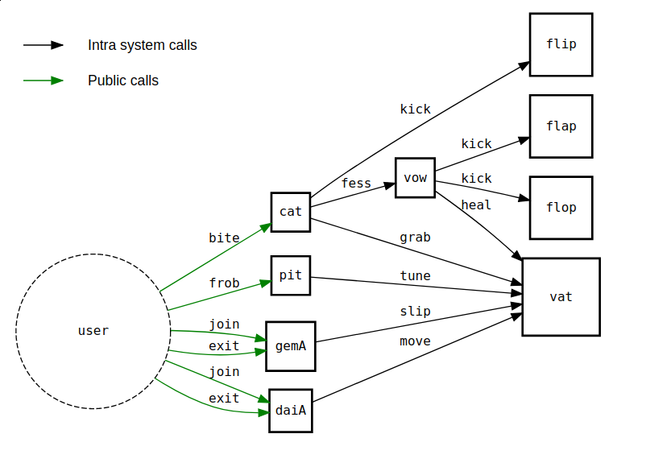
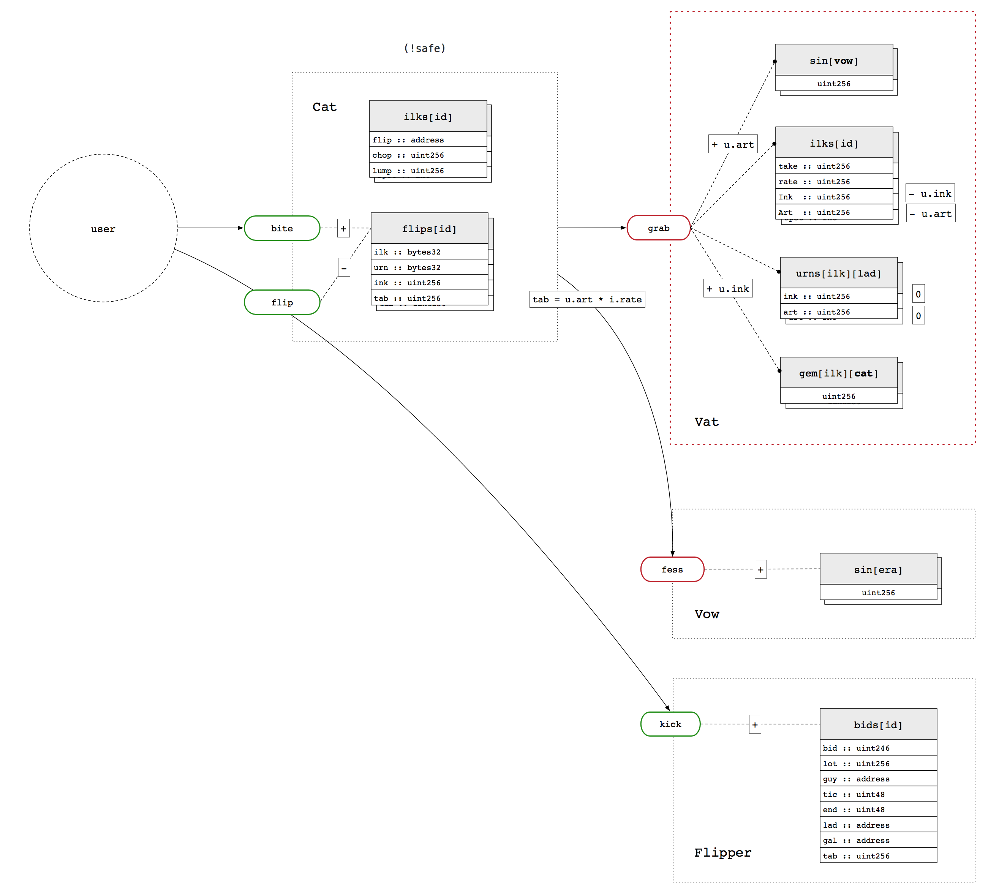
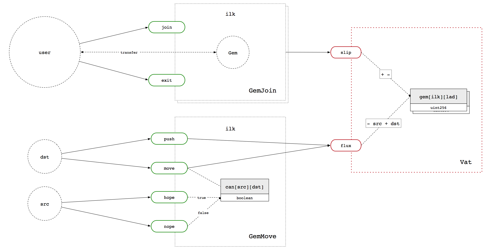
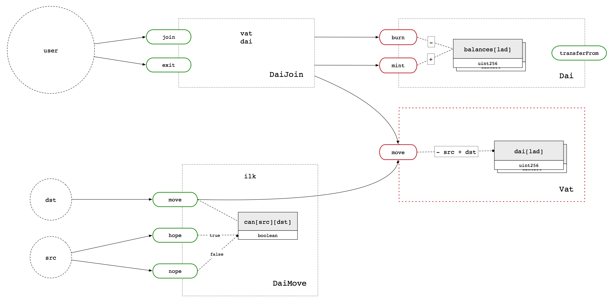

# Multi Collateral Dai Developer Guide

*work in progress*

This is a more in depth description of the Dai core contracts. The
previous iteration of Dai was called Single Collateral Dai (SCD), or
`sai`, and is found at https://github.com/makerdao/sai

## Tooling

- dapp.tools
- solc v0.4.24
- tests use ds-test and are in files ending .t.sol

## Units

Dai has three different numerical units: `wad`, `ray` and `rad`

- `wad`: fixed point decimal with 18 decimals (for basic quantities)
- `ray`: fixed point decimal with 27 decimals (for precise quantites, e.g. ratios)
- `rad`: any number multiplied by a `ray`, using integer muliplication

`wad` and `ray` units will be familiar from SCD. `rad` is a new unit and
exists to prevent precision loss in the core CDP engine. Instead of
using fixed point multiplication (e.g. `rmul`), integer multiplication is used.

Generally, `wad` should be used additively and `ray` should be used
multiplicatively. It usually doesn't make sense to multiply a wad by a
wad.

The base of `ray` is `ONE = 10 ** 27`.

## Code style

This is obviously opinionated and you may even disagree, but here are
the considerations that make this code look like it does:

- Distinct things should have distinct names ("memes")

- Lack of symmetry and typographic alignment is a code smell.

- Inheritance masks complexity and encourages over abstraction, be
  explicit about what you want.

- In this modular system, contracts generally shouldn't call or jump
  into themselves, except for math. Again, this masks complexity.

## Architecture

## CDP Engine

The core CDP, Dai, and collateral state is kept in the `Vat`. This
contract has no external dependencies and maintains the central
"Accounting Invariants" of Dai.

Dai cannot exist without collateral:

- An `ilk` is a particular type of collateral.
- Collateral `gem` is assigned to users with `slip`.
- Collateral `gem` is transferred between users with `flux`.

The CDP data structure is the `Urn`:

- it has `ink` encumbered collateral
- it has `art` encumbered debt

Similarly, a collateral `Ilk`:

- it has `Ink` encumbered collateral
- it has `Art` encumbered debt
- it has `take` collateral scaling factor (discussed further below)
- it has `rate` debt scaling factor (discussed further below)

Here, "encumbered" means "locked in a CDP".

CDPs are managed via `tune(i, u, v, w, dink, dart)`, which modifies the
CDP of user `u`, using `gem` from user `v` and creating `dai` for user
`w`.

CDPs are confiscated via `grab(i, u, v, w, dink, dart)`, which modifies
the CDP of user `u`, giving `gem` to user `v` and creating `sin` for
user `w`. `grab` is the means by which CDPs are liquidated, transferring
debt from the CDP to a users `sin` balance.

Sin represents "seized" or "bad" debt and can be cancelled out with an
equal quantity of Dai using `heal(u, v, rad)`: take `sin` from `u` and
`dai` from `v`.

Note that `heal` can also be used to *create* Dai, balanced by an equal
quantity of Sin.

Finally, the quantity `dai` can be transferred between users with `move`.

### Identifiers

The above discusses "users", but really the `Vat` does not have a
notion of "addresses" or "users", and just assigns internal values to
`bytes32` identifiers. The operator of the `Vat` is free to use any
scheme they like to manage these identifiers. A simple scheme
is to give an ethereum address control over any identifier that has the
address as the last 20 bytes.

### Rates

The ilk quantities `take` and `rate` define the ratio of exchange
between un-encumbered and encumbered Collateral and Debt respectively.

These quantitites allow for manipulations collateral and debt balances
across a whole Ilk.

Collateral can be seized or injected into an ilk using `toll(i, u, take)`,
which decreases the `gem` balance of the user `u` by increasing the
encumbered collateral balance of all urns in the ilk by the ratio
`take`.

Debt can be seized or injected into an ilk using `fold(i, u, rate)`,
which increases the `dai` balance of the user `u` by increasing the
encumbered debt balance of all urns in the ilk by the ratio `rate`.

The practical use of these mechanisms is in applying stability fees and
seizing collateral in the case of global settlement.

## CDP Interface

The `Vat` is unsuitable for use by untrusted actors. External
users can manage their CDP using the `Pit` ("trading pit").

The `Pit` contains risk parameters for each `ilk`:

- `spot`: the maximum amount of Dai drawn per unit collateral
- `line`: the maximum total Dai drawn

And a global risk parameter:

- `Line`: the maximum total Dai drawn across all ilks

The `Pit` exposes one public function:

- `frob(ilk, dink, dart)`: manipulate the callers CDP in the given `ilk`
  by `dink` and `dart`, subject to the risk parameters

## Liquidation Interface

The companion to CDP management is CDP liquidation, which is defined via
the `Cat`.

The `Cat` contains liquidation parameters for each `ilk`:

- `flip`: the address of the collateral liquidator
- `chop`: the liquidation penalty
- `lump`: the liquidation quantity

The `Cat` exposes two public functions

- `bite(ilk, urn)`: mark a specific CDP for liquidation
- `flip(n, wad)`: initiate liquidation

## Gem Fungibility

## Dai Fungibility

